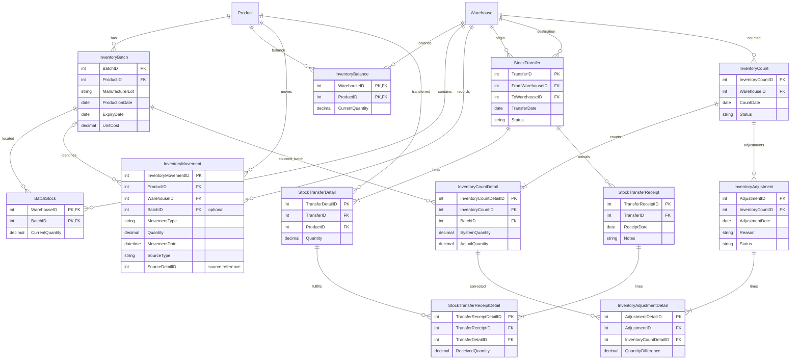

# المخزون والدفعات والتحويل والجرد

```mermaid
erDiagram
Product ||--o{ InventoryBatch : has
Product ||--o{ InventoryBalance : balance
Warehouse ||--o{ InventoryBalance : balance
InventoryBatch ||--o{ BatchStock : located
Warehouse ||--o{ BatchStock : contains
Product ||--o{ InventoryMovement : moves
Warehouse ||--o{ InventoryMovement : records
InventoryBatch o|--o{ InventoryMovement : identifies
Warehouse ||--o{ StockTransfer : origin
Warehouse ||--o{ StockTransfer : destination
StockTransfer ||--|{ StockTransferDetail : lines
Product ||--o{ StockTransferDetail : transferred
StockTransfer ||--o{ StockTransferReceipt : arrivals
StockTransferReceipt ||--|{ StockTransferReceiptDetail : lines
StockTransferDetail ||--o{ StockTransferReceiptDetail : fulfills
Warehouse ||--o{ InventoryCount : counted
InventoryCount ||--|{ InventoryCountDetail : counts
InventoryBatch ||--o{ InventoryCountDetail : counted_batch
InventoryCount ||--o{ InventoryAdjustment : adjustments
InventoryAdjustment ||--|{ InventoryAdjustmentDetail : lines
InventoryCountDetail ||--o{ InventoryAdjustmentDetail : corrected
InventoryBatch {
 int BatchID PK
 int ProductID FK
 string ManufacturerLot
 date ProductionDate
 date ExpiryDate
 decimal UnitCost
}
InventoryBalance {
 int WarehouseID PK,FK
 int ProductID PK,FK
 decimal CurrentQuantity
}
BatchStock {
 int WarehouseID PK,FK
 int BatchID PK,FK
 decimal CurrentQuantity
}
InventoryMovement {
 int InventoryMovementID PK
 int ProductID FK
 int WarehouseID FK
 int BatchID FK "optional"
 string MovementType
 decimal Quantity
 datetime MovementDate
 string SourceType
 int SourceDetailID "source reference"
}
StockTransfer {
 int TransferID PK
 int FromWarehouseID FK
 int ToWarehouseID FK
 date TransferDate
 string Status
}
StockTransferDetail {
 int TransferDetailID PK
 int TransferID FK
 int ProductID FK
 decimal Quantity
}
StockTransferReceipt {
 int TransferReceiptID PK
 int TransferID FK
 date ReceiptDate
 string Notes
}
StockTransferReceiptDetail {
 int TransferReceiptDetailID PK
 int TransferReceiptID FK
 int TransferDetailID FK
 decimal ReceivedQuantity
}
InventoryCount {
 int InventoryCountID PK
 int WarehouseID FK
 date CountDate
 string Status
}
InventoryCountDetail {
 int InventoryCountDetailID PK
 int InventoryCountID FK
 int BatchID FK
 decimal SystemQuantity
 decimal ActualQuantity
}
InventoryAdjustment {
 int AdjustmentID PK
 int InventoryCountID FK
 date AdjustmentDate
 string Reason
 string Status
}
InventoryAdjustmentDetail {
 int AdjustmentDetailID PK
 int AdjustmentID FK
 int InventoryCountDetailID FK
 decimal QuantityDifference
}
```
