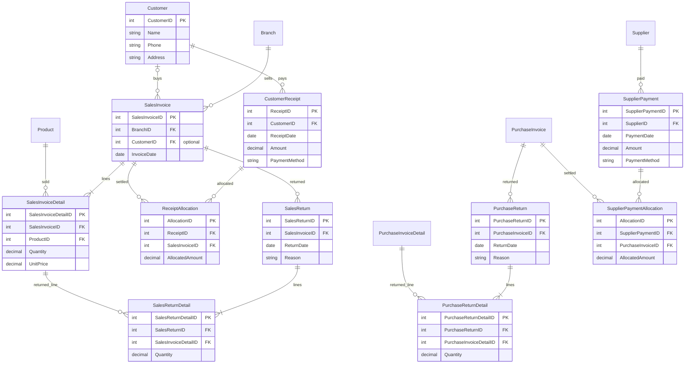

# المبيعات والمرتجعات والمدفوعات

```mermaid
erDiagram
Branch ||--o{ SalesInvoice : sells
Customer o|--o{ SalesInvoice : buys
SalesInvoice ||--|{ SalesInvoiceDetail : lines
Product ||--o{ SalesInvoiceDetail : sold
Customer ||--o{ CustomerReceipt : pays
CustomerReceipt ||--o{ ReceiptAllocation : allocated
SalesInvoice ||--o{ ReceiptAllocation : settled
SalesInvoice ||--o{ SalesReturn : returned
SalesReturn ||--|{ SalesReturnDetail : lines
SalesInvoiceDetail ||--o{ SalesReturnDetail : returned_line
PurchaseInvoice ||--o{ PurchaseReturn : returned
PurchaseReturn ||--|{ PurchaseReturnDetail : lines
PurchaseInvoiceDetail ||--o{ PurchaseReturnDetail : returned_line
Supplier ||--o{ SupplierPayment : paid
SupplierPayment ||--o{ SupplierPaymentAllocation : allocated
PurchaseInvoice ||--o{ SupplierPaymentAllocation : settled
Customer {
 int CustomerID PK
 string Name
 string Phone
 string Address
}
SalesInvoice {
 int SalesInvoiceID PK
 int BranchID FK
 int CustomerID FK "optional"
 date InvoiceDate
}
SalesInvoiceDetail {
 int SalesInvoiceDetailID PK
 int SalesInvoiceID FK
 int ProductID FK
 decimal Quantity
 decimal UnitPrice
}
CustomerReceipt {
 int ReceiptID PK
 int CustomerID FK
 date ReceiptDate
 decimal Amount
 string PaymentMethod
}
ReceiptAllocation {
 int AllocationID PK
 int ReceiptID FK
 int SalesInvoiceID FK
 decimal AllocatedAmount
}
SalesReturn {
 int SalesReturnID PK
 int SalesInvoiceID FK
 date ReturnDate
 string Reason
}
SalesReturnDetail {
 int SalesReturnDetailID PK
 int SalesReturnID FK
 int SalesInvoiceDetailID FK
 decimal Quantity
}
PurchaseReturn {
 int PurchaseReturnID PK
 int PurchaseInvoiceID FK
 date ReturnDate
 string Reason
}
PurchaseReturnDetail {
 int PurchaseReturnDetailID PK
 int PurchaseReturnID FK
 int PurchaseInvoiceDetailID FK
 decimal Quantity
}
SupplierPayment {
 int SupplierPaymentID PK
 int SupplierID FK
 date PaymentDate
 decimal Amount
 string PaymentMethod
}
SupplierPaymentAllocation {
 int AllocationID PK
 int SupplierPaymentID FK
 int PurchaseInvoiceID FK
 decimal AllocatedAmount
}
```
