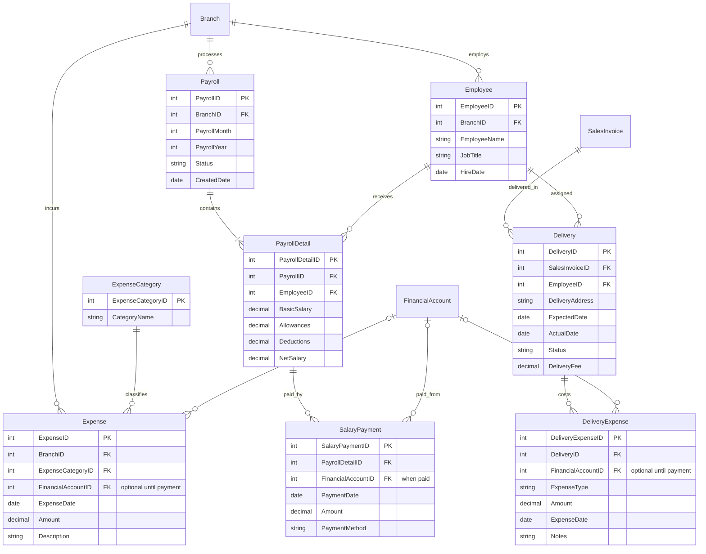

# المصروفات والموظفون والرواتب والتوصيل

```mermaid
erDiagram
Branch ||--o{ Expense : incurs
ExpenseCategory ||--o{ Expense : classifies
Branch ||--o{ Employee : employs
Branch ||--o{ Payroll : processes
Payroll ||--|{ PayrollDetail : contains
Employee ||--o{ PayrollDetail : receives
PayrollDetail ||--o{ SalaryPayment : paid_by
SalesInvoice ||--o{ Delivery : delivered_in
Employee ||--o{ Delivery : assigned
Delivery ||--o{ DeliveryExpense : costs
FinancialAccount o|--o{ Expense : paid_from
FinancialAccount o|--o{ SalaryPayment : paid_from
FinancialAccount o|--o{ DeliveryExpense : paid_from
ExpenseCategory {
 int ExpenseCategoryID PK
 string CategoryName
}
Expense {
 int ExpenseID PK
 int BranchID FK
 int ExpenseCategoryID FK
 int FinancialAccountID FK "optional until payment"
 date ExpenseDate
 decimal Amount
 string Description
}
Employee {
 int EmployeeID PK
 int BranchID FK
 string EmployeeName
 string JobTitle
 date HireDate
}
Payroll {
 int PayrollID PK
 int BranchID FK
 int PayrollMonth
 int PayrollYear
 string Status
 date CreatedDate
}
PayrollDetail {
 int PayrollDetailID PK
 int PayrollID FK
 int EmployeeID FK
 decimal BasicSalary
 decimal Allowances
 decimal Deductions
 decimal NetSalary
}
SalaryPayment {
 int SalaryPaymentID PK
 int PayrollDetailID FK
 int FinancialAccountID FK "when paid"
 date PaymentDate
 decimal Amount
 string PaymentMethod
}
Delivery {
 int DeliveryID PK
 int SalesInvoiceID FK
 int EmployeeID FK
 string DeliveryAddress
 date ExpectedDate
 date ActualDate
 string Status
 decimal DeliveryFee
}
DeliveryExpense {
 int DeliveryExpenseID PK
 int DeliveryID FK
 int FinancialAccountID FK "optional until payment"
 string ExpenseType
 decimal Amount
 date ExpenseDate
 string Notes
}
```

**ضوابط:** الدفع لا يساوي الاستحقاق، ويمنع تكرار قيد المصروف أو الراتب عند تسجيل الدفع. راجع [قواعد التنفيذ](../docs/implementation-rules.md).
