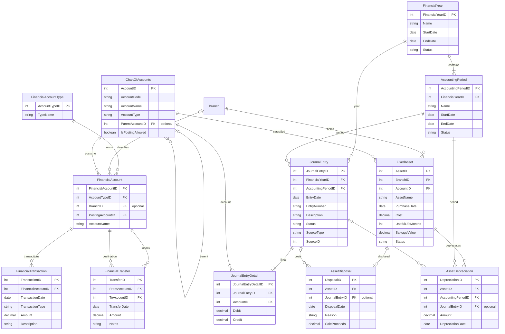

# الحسابات المالية والقيود والأصول

```mermaid
erDiagram
FinancialAccountType ||--o{ FinancialAccount : classifies
Branch o|--o{ FinancialAccount : owns
ChartOfAccounts ||--o{ FinancialAccount : posts_to
FinancialAccount ||--o{ FinancialTransaction : transactions
FinancialAccount ||--o{ FinancialTransfer : source
FinancialAccount ||--o{ FinancialTransfer : destination
ChartOfAccounts o|--o{ ChartOfAccounts : parent
FinancialYear ||--|{ AccountingPeriod : contains
FinancialYear ||--o{ JournalEntry : year
AccountingPeriod ||--o{ JournalEntry : period
JournalEntry ||--|{ JournalEntryDetail : lines
ChartOfAccounts ||--o{ JournalEntryDetail : account
Branch ||--o{ FixedAsset : holds
ChartOfAccounts ||--o{ FixedAsset : classified
FixedAsset ||--o{ AssetDepreciation : depreciates
AccountingPeriod ||--o{ AssetDepreciation : period
JournalEntry o|--o{ AssetDepreciation : posts
FixedAsset ||--o| AssetDisposal : disposed
JournalEntry o|--o{ AssetDisposal : posts
FinancialAccountType {
 int AccountTypeID PK
 string TypeName
}
FinancialAccount {
 int FinancialAccountID PK
 int AccountTypeID FK
 int BranchID FK "optional"
 int PostingAccountID FK
 string AccountName
}
FinancialTransaction {
 int TransactionID PK
 int FinancialAccountID FK
 date TransactionDate
 string TransactionType
 decimal Amount
 string Description
}
FinancialTransfer {
 int TransferID PK
 int FromAccountID FK
 int ToAccountID FK
 date TransferDate
 decimal Amount
 string Notes
}
ChartOfAccounts {
 int AccountID PK
 string AccountCode
 string AccountName
 string AccountType
 int ParentAccountID FK "optional"
 boolean IsPostingAllowed
}
FinancialYear {
 int FinancialYearID PK
 string Name
 date StartDate
 date EndDate
 string Status
}
AccountingPeriod {
 int AccountingPeriodID PK
 int FinancialYearID FK
 string Name
 date StartDate
 date EndDate
 string Status
}
JournalEntry {
 int JournalEntryID PK
 int FinancialYearID FK
 int AccountingPeriodID FK
 date EntryDate
 string EntryNumber
 string Description
 string Status
 string SourceType
 int SourceID
}
JournalEntryDetail {
 int JournalEntryDetailID PK
 int JournalEntryID FK
 int AccountID FK
 decimal Debit
 decimal Credit
}
FixedAsset {
 int AssetID PK
 int BranchID FK
 int AccountID FK
 string AssetName
 date PurchaseDate
 decimal Cost
 int UsefulLifeMonths
 decimal SalvageValue
 string Status
}
AssetDepreciation {
 int DepreciationID PK
 int AssetID FK
 int AccountingPeriodID FK
 int JournalEntryID FK "optional"
 decimal Amount
 date DepreciationDate
}
AssetDisposal {
 int DisposalID PK
 int AssetID FK
 int JournalEntryID FK "optional"
 date DisposalDate
 string Reason
 decimal SaleProceeds
}
```
