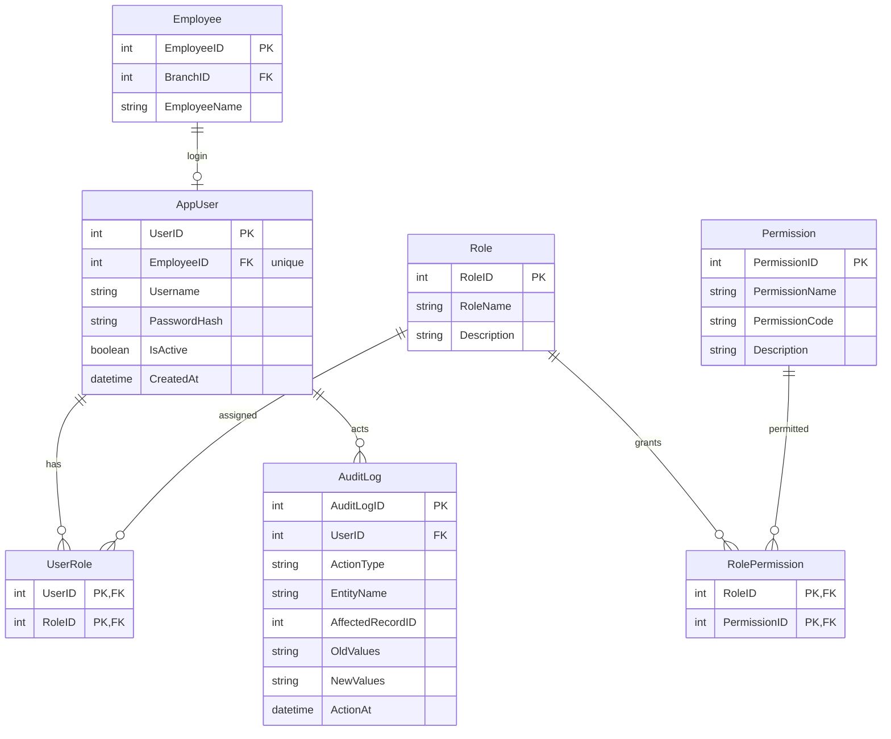

# المستخدمون والصلاحيات والتدقيق

```mermaid
erDiagram
Employee ||--o| AppUser : login
AppUser ||--o{ UserRole : has
Role ||--o{ UserRole : assigned
Role ||--o{ RolePermission : grants
Permission ||--o{ RolePermission : permitted
AppUser ||--o{ AuditLog : acts
Employee {
 int EmployeeID PK
 int BranchID FK
 string EmployeeName
}
AppUser {
 int UserID PK
 int EmployeeID FK "unique"
 string Username
 string PasswordHash
 boolean IsActive
 datetime CreatedAt
}
Role {
 int RoleID PK
 string RoleName
 string Description
}
UserRole {
 int UserID PK,FK
 int RoleID PK,FK
}
Permission {
 int PermissionID PK
 string PermissionName
 string PermissionCode
 string Description
}
RolePermission {
 int RoleID PK,FK
 int PermissionID PK,FK
}
AuditLog {
 int AuditLogID PK
 int UserID FK
 string ActionType
 string EntityName
 int AffectedRecordID
 string OldValues
 string NewValues
 datetime ActionAt
}
```
